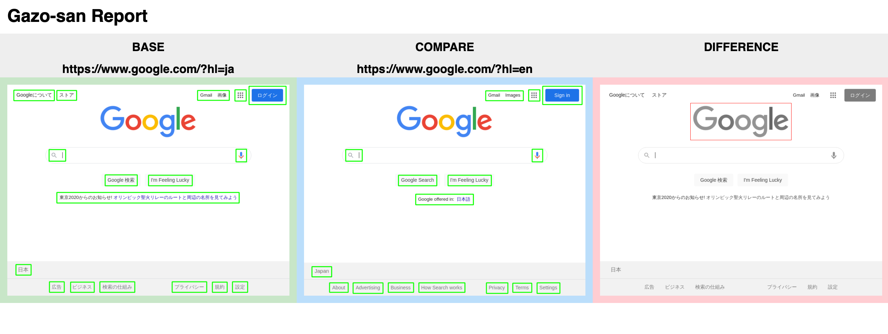

# Gazo-san-report

# What is gazo-san-report
Gazo-san-report is a report tool for visual testing between two URLs.
It will create an HTML report as the output. Or show the HTML report on the local server by nginx using port 80.

It's useful for checking web applications between different environments. For example, checking differences between development environment and production environment.
## Usage

### Output as an HTML report
Start docker container by passing the target URLs in environment variables. The report will be created in the directory you have mounted.

```
docker run -it -d --rm -v `pwd`:/report --env BaseURL="https://www.google.com/?hl=ja" --env CompareURL="https://www.google.com/?hl=en" aa332266/gazo-san-report:latest
```

### Show an HTML report on the local server
By passing the argument `local-server` and expose the port 80.

```
docker run -it -d -p 8080:80 --env BaseURL="https://www.google.com/?hl=ja" --env CompareURL="https://www.google.com/?hl=en" aa332266/gazo-san-report:latest local-server
```

## Check the report
Check the HTML report file or check on the local server.

http://localhost:8080/



## Built With
Difference detects by [Gazo-san](https://github.com/lifull-dev/Gazo-san)

Web screenshot by [puppeteer](https://github.com/puppeteer/puppeteer)

## Registry
https://hub.docker.com/repository/docker/aa332266/gazo-san-report